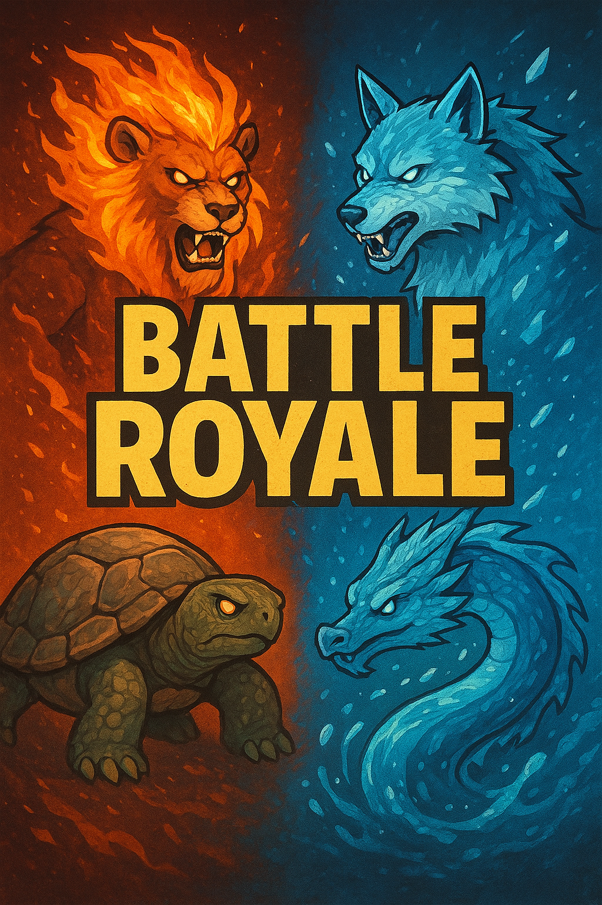

# Pokecraft 

Pokecraft es una simulación en C++, inspirada en Pokemon y Minecraft,  donde pokemons en un mapa recolectaran objetos de Minecraft y participaran en un battle royale por la victoria. Cada pokemon tiene tipo (Fuego, Agua, Planta, Eléctrico), vida, armadura, daño y una lista de objetos. La partida  genera pokemons y objetos aleatorios, coloca entidades en un mapa y simula combates entre pokemons.No hay UI incluida en los archivos analizados, la interacción observable es por consola.

Características principales
---------------------------
- Sistema de tipos elementales (Fuego, Agua, Planta, Eléctrico) con reglas de daño.
- Objetos equipables: Armas (infligen daño), Armaduras (añaden armadura), Botiquines (curación).
- Mapa con Casillas que contienen Pokemons y Objetos.
- Simulación automatizada de batallas por turnos, ordenadas por velocidad.
- Generación aleatoria de pokemons y objetos.

## Cómo ejecutar 

- **Desde Visual Studio:**  
  1. Abrir la solución (`.sln`) en Visual Studio.  
  2. Seleccionar el proyecto principal como proyecto de inicio.  
  3. Ejecutar la solución usando el botón de **Iniciar** o `F5`.

- **Desde línea de comandos:**  
  1. Abrir una terminal o consola en la carpeta del proyecto.  
  2. Compilar el proyecto usando el compilador de C++ correspondiente.  
  3. Ejecutar el binario generado desde la misma terminal.

# Flujo de Juego

- **Mapa**
  - Se crea un mapa cuadrado de tamaño `N`, como una matriz de `Casilla`.
  - Cada `Casilla` puede contener un `Pokemon` y/o un `Objeto`.
  - Los objetos se generan y se colocan en casillas libres (`objeto == nullptr`).

- **Pokémon**
  - La clase `Partida` crea los Pokémon:
    - Llama a `crearPokemons`, que invoca `crearPokemonAleatorio` varias veces.
    - Cada Pokémon recibe un inventario inicial.
    - Se coloca en una casilla libre del mapa.
  - Se generan objetos de tipo `Arma`, `Armadura` y `Botiquín` tanto al crear el mapa como al equipar Pokémon.

- **Objetos en el mapa**
  - Permanecen en las casillas hasta que un Pokémon los recoja.

- **Batallas**
  - Se compara la velocidad de los Pokémon, el más rápido ataca primero.
  - Cada ataque usa `Pokemon->atacar`, que llama a `calcularDanno` y aplica efectividad según el tipo:
    - Agua → x2 daño a Fuego
    - Planta → x2 daño a Agua
    - Fuego → x2 daño a Planta
    - Eléctrico → pequeño bonus fijo 
  - El daño se resta de la vida del objetivo con `restarVida`.

- **Uso de objetos en batalla**
  - Antes de cada ronda, `Partida->usarObjetos` selecciona un objeto del inventario (aleatorio entre los primeros 5) y lo aplica:
    - **Arma:** aplica daño directo (sobre quien la usa).
    - **Armadura:** aumenta la armadura (`annadirArmadura`).
    - **Botiquín:** restaura vida.

- **Fin de batalla**
  - Si la vida de un Pokémon llega a 0:
    - Se marca como no vivo (`vivo = false`).
    - La casilla se libera y se ajusta la lista de participantes.

- **Recolección de objetos**
  - Cuando un pokemon queda en una casilla que contiene un Objeto, la función recolectarObjetos recorre el vector de objetos del mapa y añade al inventario del pokemon los objetos cuyo x,y coincidan.
  - Al añadirse al inventario, el objeto se elimina de la lista/posición del mapa.

- **Zona azul**
  - Partida->reducirZonaAzul simula un daño ambiental en los bordes de un área cuadrada centrada en (x,y). La función recorre las casillas del perímetro del cuadrado y, si encuentra pokemons, los marca como no vivos y libera la casilla. Este mecanismo permite eliminar entidades fuera del área segura, similar a las zonas de contracción en un battle-royale.

# Jerarquía de Clases

  - **Entidad**  
    - **Pokemon** (abstracta)  
      - PokemonFuego  
      - PokemonAgua  
      - PokemonPlanta  
      - PokemonElectrico  
    - **Objeto** (abstracta)  
      - **Arma**  
        - ArmaMadera  
          - Martillo 
          - Hacha    
          - Espada  
        - ArmaHierro  
          - Martillo  
          - Hacha   
          - Espada   
        - ArmaDiamante  
          - Martillo  
          - Hacha    
          - Espada   
      - **Armadura**  
        - ArmaduraCuero  
        - ArmaduraHierro  
        - ArmaduraDiamante  
      - Botiquin  

  - **Casilla**  
  - **Mapa**  
  - **Partida**

Entidad
│
├── Pokemon (abstracta)
│   ├── PokemonFuego
│   ├── PokemonAgua
│   ├── PokemonPlanta
│   └── PokemonElectrico
│
└── Objeto (abstracta)
    │
    ├── Arma
    │   ├── ArmaMadera
    │   ├── ArmaHierro
    │   └── ArmaDiamante
    │
    ├── Armadura
    │   ├── ArmaduraCuero
    │   ├── ArmaduraHierro
    │   └── ArmaduraDiamante
    │
    └── Botiquin

# Explicación  de las clases 

- **Pokemon (clase abstracta)**

  Representa una entidad  del juego que contiene todo el estado necesario para participar en la simulación (posición, vida, armadura, daño base, inventario y velocidad).  
  Atributos clave: vida, vidaMax, armadura, danno, velocidad, objetos (lista), tipo (TiposPokemon), controlado (flag).  
  - Pokemon->atacar(Pokemon* objetivo): calcula el daño efectivo invocando Pokemon->calcularDanno según el tipo del objetivo y aplica el daño mediante objetivo->restarVida.
  - Pokemon->restarVida(int cantidad): decrementa la vida y marca vivo = false si la vida llega a 0 o menos.
  - Pokemon->annadirVida(int cantidad): suma vida sin superar vidaMax.
  - Pokemon->annadirArmadura(int cantidad): incrementa el atributo armadura.
  - Pokemon->annadirObjeto(Objeto*): añade un objeto al inventario.
  - Pokemon->moverse(int dx, int dy): actualiza las coordenadas internas x,y.
  - Pokemon->calcularDanno(TiposPokemon tipoRival): método abstracto (implementado en subclases) que devuelve el daño final aplicado según la relación de tipos.
  - La clase gestiona también la propiedad y borrado del inventario (en el destructor se eliminan los objetos contenidos).

- **PokemonFuego / PokemonAgua / PokemonPlanta / PokemonElectrico**

  Aplicar la regla de daño específica de cada tipo mediante la sobrescritura de Pokemon->calcularDanno.  
  Resumen de comportamiento (según implementación):
  - PokemonFuego->calcularDanno: doble daño frente a Planta, mitad frente a Agua.
  - PokemonAgua->calcularDanno: doble daño frente a Fuego, mitad frente a Planta.
  - PokemonPlanta->calcularDanno: doble daño frente a Agua, mitad frente a Fuego.
  - PokemonElectrico->calcularDanno: aplica un pequeño bonus fijo (implementado como multiplicador ~1.1).
  Otras notas: cada subclase mantiene un contador estático de instancias (p. ej. contadorFuego) para métricas.

- **Entidad** 
  Clase base general  que ofrece atributos comunes a Pokemon y Objeto, como posición (x,y), flag vivo y nombre.

- **Objeto (clase abstracta)**  
  Representa cualquier ítem que puede existir en el mapa o en el inventario de un pokemon.  
  Atributos clave: cogido (flag), numUsos, tipo (TiposObjeto), posición x,y y nombre.  
  Método esencial:
  - Objeto->utilizar(Pokemon* usuario) — pure virtual: efectúa el efecto del objeto sobre el pokemon que lo usa.  

- **Arma (clase base)**  
  Objetos que infligen daño directo cuando se usan.  
  Atributos: danno (int), numUsos.  
  Método principal:
  - Arma->utilizar(Pokemon* usuario): en la implementación actual reduce la vida del pokemon que la usa mediante usuario->restarVida(danno) y decrementa numUsos; si numUsos <= 0, marca vivo = false.
  - Existen variantes por material: ArmaMadera, ArmaHierro, ArmaDiamante. Cada variante asigna valores de danno distintos según el tipo funcional.
    - ArmaHierro: Martillo=30, Hacha=50, Espada=80.
    - ArmaDiamante: Martillo=50, Hacha=80, Espada=110.
    

- **Armadura (clase base)**  
  Objetos que incrementan la armadura del pokemon al usarse.  
  Atributos: resistencia (int).  
  Método principal:
  - Armadura->utilizar(Pokemon* usuario): llama a usuario->annadirArmadura(resistencia) y marca el objeto como usado (vivo = false).  
  Variantes y valores implementados:
  - ArmaduraCuero: Casco=20, Mallas=30, Pechera=50.
  - ArmaduraHierro: Casco=30, Mallas=50, Pechera=80.
  - ArmaduraDiamante: Casco=40, Mallas=80, Pechera=110.

- ***Botiquin***  
  objeto curativo que restaura vida al pokemon cuando se usa.  

- **Tipos y enums**  
  - TiposArma: Martillo, Hacha, Espada. 
  - TiposArmadura: Casco, Mallas, Pechera. Determinan la resistencia asignada por cada implementación de Armadura.  
  - TiposObjeto: Armas, Armadura, BotiquinObjeto. Clasifican el comportamiento polimórfico de Objeto->utilizar y permiten decidir acciones en Partida->usarObjetos.

- **Casilla**  
  Contenedor de una posición del mapa.  
  Atributos: pokemon y objeto .  
  Estructura simple que mantiene referencias a la entidad y al ítem presentes en esa celda. 

- **Mapa**  
  Representación espacial del escenario, mantiene MatrizCasillas  y funciones para crear celdas y generar objetos.  
  Métodos importantes:
  - Mapa->crearMapa(int tamaño): reserva la matriz y crea cada Casilla con new.
  - Mapa->generarObjetos(int nObjetos): usa un vector de fábricas para crear instancias aleatorias de Arma, Armadura y Botiquin y colocarlas en casillas libres.

- **Partida**  
  Controlador de la simulación, coordina creación de pokemons, emparejamientos, resolución de batallas, uso de objetos y efectos globales (zona azul).  
  Métodos claves:
  - Partida->crearPokemons(int cantidad): crea una los pokemons iniciales invocando crearPokemonAleatorio repetidamente.
  - Partida->crearPokemonAleatorio(): instancia un Pokemon concreto (Fuego/Agua/Planta/Electrico) con inventario inicial  y lo posiciona en una casilla libre del mapa.
  - Partida->equipInicio(): crea una lista inicial de objetos (Arma/Armadura/Botiquin) que se asigna a cada pokemon al crearse.
  - Partida->batalla(...): gestiona la secuencia de combate entre dos pokemons, invocando Partida->usarObjetos sobre ambos antes de iniciar intercambios de ataques. Determina el pokemon veloz por velocidad y aplica ataques alternos hasta la muerte de uno.
  - Partida->usarObjetos(Pokemon* p): elige un objeto aleatorio entre los primeros 5 del inventario y llama a objeto->utilizar(p). Imprime por consola la acción realizada.
  - Partida->reducirZonaAzul(int cx, int cy): recorre el perímetro de un cuadrado centrado en (cx,cy) y elimina (marca vivo = false) pokemons en las casillas del borde, libera la referencia en la casilla.
  - Partida->objetosMapa() y Partida->comprobarObjetoEnCasilla/comprobarPokemonEnCasilla: utilidades para obtener ítems y entidades en coordenadas específicas.

# Conclusiones
El proyecto presenta una estructura orientada a la programación orientada a objetos, con separación entre entidades, objetos y control de juego, y   uso del polimorfismo para aplicar las reglas de daño según tipo. Entre sus limitaciones actuales, la gestión de memoria es manual, lo que puede generar fugas o errores, por lo que sería recomendable usar smart pointers, y la simulación no cuenta con interfaz de usuario ni manejo avanzado de entrada, ejecutándose únicamente por consola. A pesar de estas limitaciones, el código sirve como una base sólida y extensible para futuras mejoras y ampliaciones del proyecto.
 

# Créditos
- Proyecto realizado en C++ (Visual Studio).
- Autores: Hilario Javier, Jose Moreno y Alex.

